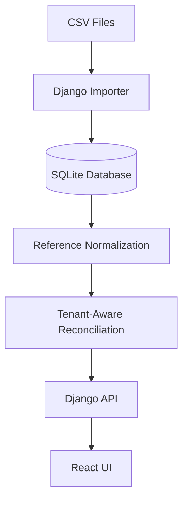

# ADOSX Full-Stack Assignment

A small full-stack reconciliation application that compares records from two systems, identifies disagreements, and keeps data isolated by organization/tenant.

## 📌 Overview

`System A` and `System B` contain records representing the same events, but neither system is authoritative. 

The application imports the supplied CSV files into a `SQLite` database, normalizes `System B` references, compares records using organization-aware matching, and exposes the disagreements through a `Django API` and `React UI`.

The application identifies:
* **Records present in System A** but missing from System B
* **System B entries** pointing to records that do not exist in System A
* **Duplicate System B entries** for the same record
* **Records where System A and System B** report different values

### 📊 Disagreement Summary
The supplied dataset produces exactly **12 disagreements**:
* 5 value mismatches
* 3 missing in System B
* 2 duplicate entries in System B
* 2 orphan entries in System B

---

## 🛠️ Tech Stack

### Backend
* **Language:** Python
* **Framework:** Django & Django ORM
* **Database:** SQLite
* **Testing:** Django TestCase

### Frontend
* **Library:** React (Vite)
* **Language:** JavaScript
* **Data Fetching:** Fetch API

---

## 📂 Project Structure

```text
adosx-fullstack-assignment/
├── backend/
│   ├── manage.py
│   ├── core/
│   └── reconciliation/
│       ├── models.py
│       ├── views.py
│       ├── urls.py
│       ├── services/
│       │   ├── importer.py
│       │   ├── normalizer.py
│       │   └── comparison.py
│       ├── management/
│       │   └── commands/
│       │       └── import_data.py
│       └── tests/
│           ├── test_normalizer.py
│           └── test_comparison.py
├── frontend/
│   └── src/
│       └── data/
│           ├── locations.csv
│           ├── system_a.csv
│           └── system_b.csv
├── DECISIONS.md
└── README.md
```

---

## 🏗️ Architecture & Data Flow



### Data Model
The database contains four main models:
1. `Organization`
2. `Location`
3. `SystemARecord`
4. `SystemBRecord`

* `Location` models provide the organization/tenant mapping.
* A record is matched uniquely using the composite key: `(organization_id, record_id)`.

### Reference Normalization Flow
For `System B`, the `record_ref` is normalized first to prevent mismatched evaluation:
`raw_record_ref` → `normalize_record_ref()` → `normalized_record_ref`

This prevents records with the same identifier but belonging to different organizations from being cross-matched incorrectly.

---

## 🧹 Handling Dirty Data

The importer preserves the original CSV row using a `raw_data` field. Parsed values are stored separately, and processing issues are recorded safely in `import_errors`. 

Examples of handled dirty input cases:
* Multiple formats of `System B` record references
* Blank/null values
* Comma-formatted numeric values
* Duplicate `System B` references
* Orphan `System B` references

> ⚠️ **Note:** Rows are never silently discarded because of a malformed value that can be safely represented as missing or invalid.

### Record Reference Normalization
`System A`'s `record_id` is treated as the canonical identifier. `System B`'s `record_ref` is normalized based on known patterns:
* `REC-1034` → `REC-1034`
* `rec1034` → `REC-1034`
* `REC - 1070` → `REC-1070`
* `1112` → `REC-1112`

*Unrecognized formats are not aggressively guessed; they are flagged explicitly as unrecognized.*

---

## ⚖️ Reconciliation Rules

For every `System A` record:
1. Build a tenant-aware key using `organization` + `record ID`.
2. Find matching `System B` entries using `organization` + `normalized record reference`.
3. Evaluate against matching conditions:
   * **No entry exists:** Report `MISSING_IN_B`.
   * **Multiple entries exist:** Report `DUPLICATE_IN_B`.
   * **Exactly one entry exists & values differ:** Report `VALUE_MISMATCH`.

After processing `System A`, any remaining unmatched `System B` entries are reported as `ORPHAN_IN_B`.

### Tenant Isolation
Tenant isolation is strictly enforced during reconciliation rather than only in the client frontend layer. 

* **System A:** `ORG-A` + `REC-1077`
* **System B:** `ORG-B` + `REC-1077`

These are treated as entirely different records because the organization identifier forms part of the matching key. The UI and API natively support filtering disagreements by organization.

---

## 🚀 API Reference

### Get Organizations
* **Endpoint:** `GET /api/orgs/`
* **Response Example:**
```json
[
  { "org_id": "ORG-A" },
  { "org_id": "ORG-B" }
]
```

### Get Disagreements
* **Endpoint:** `GET /api/disagreements/`
* **Optional Query Parameters:** `org_id`, `reason`, `sort`
* **Query Examples:**
  * `/api/disagreements/?org_id=ORG-A`
  * `/api/disagreements/?reason=VALUE_MISMATCH`
  * `/api/disagreements/?org_id=ORG-A&reason=VALUE_MISMATCH`
  * `/api/disagreements/?sort=value_asc`
  * `/api/disagreements/?sort=value_desc`

---

## 💻 Getting Started

### Backend Setup
1. Navigate to the backend directory:
```bash
cd backend
```
2. Create and activate a virtual environment:
```bash
python -m venv venv
# On Windows:
.\venv\Scripts\activate
# On macOS/Linux:
source venv/bin/activate
```
3. Install dependencies:
```bash
pip install -r requirements.txt
```
4. Run migrations:
```bash
python manage.py migrate
```
5. Import the CSV data seed:
```bash
python manage.py import_data
```
6. Start the development server:
```bash
python manage.py runserver
```
The API endpoint will be available locally at `http://127.0.0`.

### Frontend Setup
1. Navigate to the frontend directory:
```bash
cd frontend
```
2. Install package dependencies:
```bash
npm install
```
3. Boot the local development client:
```bash
npm run dev
```
Open the Vite development URL shown in your terminal context.

### Running Tests
Execute tests from the `backend/` directory footprint:
```bash
python manage.py test
```
The test cases explicitly target reconciliation business logic, covering:
* Value mismatches
* Missing `System B` entries
* Orphan `System B` entries
* Duplicate `System B` entries
* Cross-organizational identifier collisions

---

## ✂️ Deliberate Scope Cuts

This project was time-boxed. The implementation intentionally does not include production features such as:
* Authentication & user management systems
* Upload interactive UI for arbitrary user CSV files
* Background workers & async task processing queues
* Real-time sync updates
* Table pagination or advanced fuzzy search bars
* Metric charts or data dashboards
* CSV/Excel export functionality
* Production cloud database infrastructure

---

## 🤖 AI Collaboration & Methodology

I utilized an AI coding agent as a development partner for implementation guidance, debugging workflows, and core architecture validation. 

The agent helped to:
* Break down milestones cleanly.
* Whiteboard database structures and matching systems.
* Scaffold initial unit tests.
* Unblock specific runtime stack errors.

### Human Verification Steps
Generated code was not treated as automatically correct. I explicitly ran independent verifications:
* Checked that all supplied file rows were safely imported.
* Confirmed duplicate `System B` entries were preserved without dropping data.
* Ensured repeated execution of imports was idempotent (did not multiply database entries).
* Inspected tenant isolation behavior by testing matching logic against ID collisions across organizations.

---

## 💭 Reflection

### a. Name one thing the AI agent got wrong. How did you notice?
One initial implementation draft generated by the agent used `.create()` for `System B` entries without considering repeated imports. While this successfully preserved duplicate record references in a single run, running the import command twice created duplicate copies of every record in the database. 

I caught this during manual verification after running the importer multiple times. I corrected the design to leverage unique item entry IDs (`entry_id`) for safe, idempotent imports while keeping the ability to naturally record genuine duplicate `record_ref` rows.

### b. Which part of your submission are you least confident about, and why?
The CSV importer logic. It is the area most exposed to raw assumptions about how real-world data systems export values. While the current setup safely addresses all dirty scenarios present in the provided dataset, additional edge cases and structural anomalies in future exports would require more defensive exception testing blocks.

### c. If you had a second day, what would you fix first?
I would immediately expand the test coverage of the input parser pipeline to account for edge cases like broken headers or structural row misalignments. Following that, I would clean up the state management layer between the API and UI to support smoother client error boundaries.
